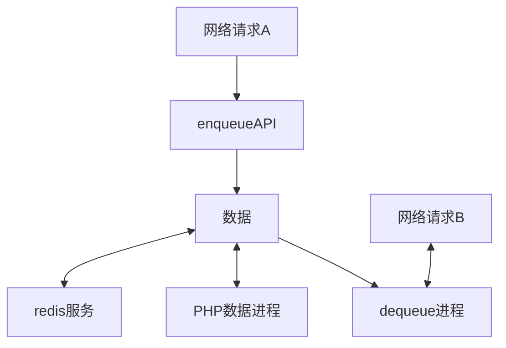
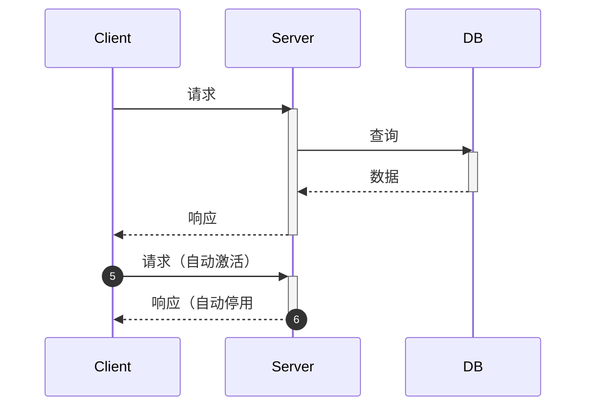

```mermaid
graph TD;
    数据<-->redis服务;
    数据<-->PHP数据进程;
    enqueueAPI-->数据;
    数据-->dequeue进程;
    网络请求A-->enqueueAPI;
    网络请求B<-->dequeue进程;

```

```mermaid
sequenceDiagram
    participant Client
    participant Server
Client->>Server: 请求
activate Server
Server->>DB: 查询
activate DB
DB-->>Server: 数据
deactivate DB
Server-->>Client: 响应
deactivate Server
autonumber
Client->>+Server: 请求（自动激活）
Server-->>-Client: 响应（自动停用
```